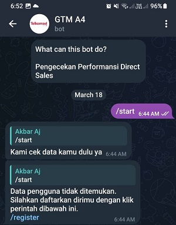

# BOT TELEGRAM WITH PYTHON : Telkomsel Bot User
Repository for Telegram Bot using Python.
## Overview
By using the telegram bot library in python, a bot was created that can automatically calculate the revenue of Telkomsel on the Makassar branch.

## Table of Contents

- [Getting Started](#getting-started)
  - [Prerequisites](#prerequisites)
  - [Installation](#installation)
- [Usage](#usage)
  - [Data Preparation](#data-preparation)
  - [Login](#login)
  - [Register](#register)
  - [Search](#search)
- [Results MoM](#results-search)
- [License](#license)

## Getting Started

### Prerequisites
To install all the libraries needed in this model, use the syntax below:
```bash
pip install -r requirements.txt
```
### Installation
```bash
# Clone the repository
git clone https://github.com/AkbarAj15/Bot_Tele_Tsel.git

# Change directory
cd Bot_Tele_Tsel # change with your folder name

# Install dependencies
pip install -r requirements.txt
```
## Usage

At this stage there is an introduction to the features that can be done by this telegram bot to check the performance of direct sales.

### Data Preparation
At this stage there is a process of preparing the data retrieved through the database. As for some of the main queries needed as below.
```bash
// Melakukan Perhitungan MoM 
SELECT trx_cvm, (CASE WHEN SUM(CASE WHEN cat_periode = 'BULAN_M1' THEN trx_cvm ELSE 0 END) <> 0 
    THEN ((SUM(CASE WHEN cat_periode = 'BULAN_M' THEN trx_cvm ELSE 0 END) / SUM(CASE WHEN cat_periode = 'BULAN_M1' THEN trx_cvm ELSE 0 END) - 1) * 100) 
    ELSE 0 END) AS MoM_trx_cvm,
```

### Login
Automatic login feature. In this feature, DS or users can be automatically checked for data when giving the /start command to the telegram bot.

```bash

```

### Model Training
For the model training process, we used tensorflow.keras which uses 3 hidden layers. Which will be compiled using *adam* optimizer and loss params *sparse_categorical_crossentropy*.
```bash
# Split the data into training and testing sets
X_train, X_test, y_train, y_test = train_test_split(X_scaled, data['Cluster'], test_size=0.2, random_state=42)

# Define the TensorFlow model
model = tf.keras.Sequential([
    tf.keras.layers.Dense(64, activation='relu', input_shape=(X_train.shape[1],)),
    tf.keras.layers.Dense(32, activation='relu'),
    tf.keras.layers.Dense(16, activation='relu'),
    tf.keras.layers.Dense(5, activation='softmax')
])

# Compile the model
model.compile(optimizer='adam', loss='sparse_categorical_crossentropy', metrics=['accuracy'])
```
### Model Evaluation
To evaluate the model, we first train it for 10 iterations or epochs. then we evaluate it based on the train and testing data.
```bash
# Train the model
model.fit(X_train, y_train, epochs=10, batch_size=32, verbose=1, validation_data=(X_test, y_test))

# Evaluate the model
test_loss, test_accuracy = model.evaluate(X_test, y_test)
```
## Results
To check the result, we will try to fill the random input into the model first.
```bash
# Inputan baru untuk diprediksi
new_input = np.array([[3.8, 5, 3, 2, 1, 1, 1, 14, 13]])  # Ganti dengan inputan yang sesuai

# Lakukan standardisasi pada inputan baru
new_input_scaled = scaler.transform(new_input)

# Lakukan prediksi cluster
predicted_cluster = kmeans.predict(new_input_scaled)

# Tampilkan hasil prediksi
print("Inputan masuk ke cluster:", predicted_cluster)
if predicted_cluster == 0:
    print("Pemerintah")
elif predicted_cluster == 1:
    print("Swasta")
elif predicted_cluster == 2:
    print("Organisasi")
elif predicted_cluster == 3:
    print("Prestasi")
elif predicted_cluster == 4:
    print("Bantuan")
```
*output :* 
*Inputan masuk ke cluster: [1]
Swasta*

## License
Copyright © 2023 Pakintaki Group . All rights reserved.


