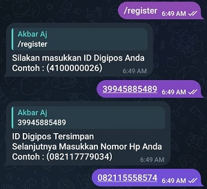
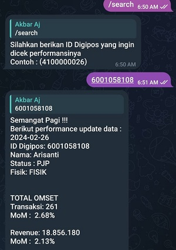

# BOT TELEGRAM WITH PYTHON : Telkomsel Bot User
Repository for Telegram Bot using Python.
## Overview
By using the telegram bot library in python, a bot was created that can automatically calculate the revenue of Telkomsel on the Makassar branch.

## Table of Contents

- [Getting Started](#getting-started)
  - [Prerequisites](#prerequisites)
  - [Installation](#installation)
- [Usage](#usage)
  - [Data Preparation](#data-preparation)
  - [Login](#login)
  - [Register](#register)
  - [Search](#search)
- [License](#license)

## Getting Started

### Prerequisites
To install all the libraries needed in this model, use the syntax below:
```bash
pip install -r requirements.txt
```
### Installation
```bash
# Clone the repository
git clone https://github.com/AkbarAj15/Bot_Tele_Tsel.git

# Change directory
cd Bot_Tele_Tsel # change with your folder name

# Install dependencies
pip install -r requirements.txt
```
## Usage

At this stage there is an introduction to the features that can be done by this telegram bot to check the performance of direct sales.

### Data Preparation
At this stage there is a process of preparing the data retrieved through the database. As for some of the main queries needed as below.
```bash
// Melakukan Perhitungan MoM 
SELECT trx_cvm, (CASE WHEN SUM(CASE WHEN cat_periode = 'BULAN_M1' THEN trx_cvm ELSE 0 END) <> 0 
    THEN ((SUM(CASE WHEN cat_periode = 'BULAN_M' THEN trx_cvm ELSE 0 END) / SUM(CASE WHEN cat_periode = 'BULAN_M1' THEN trx_cvm ELSE 0 END) - 1) * 100) 
    ELSE 0 END) AS MoM_trx_cvm,
```

### Login
Automatic login feature. In this feature, DS or users can be automatically checked for data when giving the /start command to the telegram bot.<br>


### Register
In this feature, users who have not registered will be directed to register first.<br>



### Search
The most important feature is search. to check the performance of DS in making sales.<br>


From the picture above, we can see that the data appears automatically if you have entered the correct digipos id.<br>

## License
Copyright © 2024 Telkomsel. All rights reserved.


